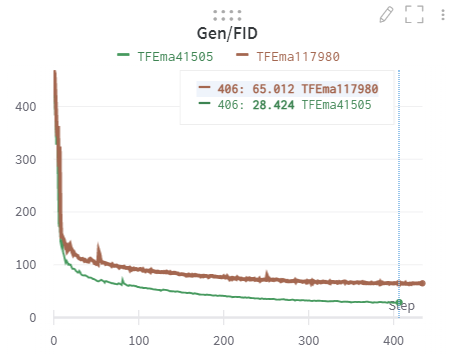
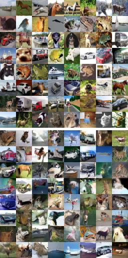
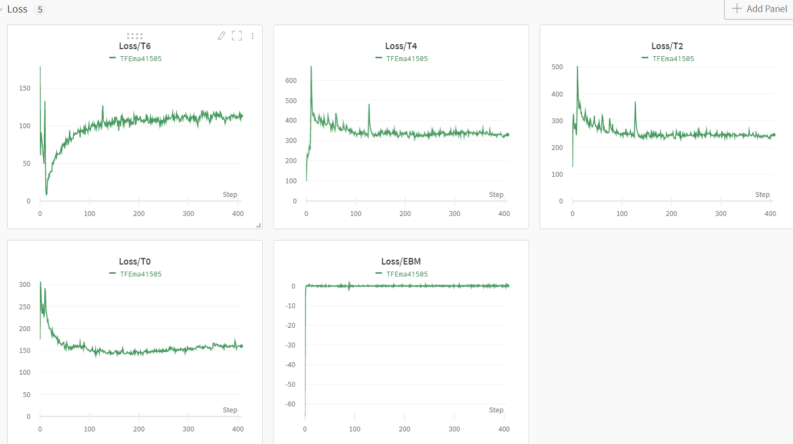
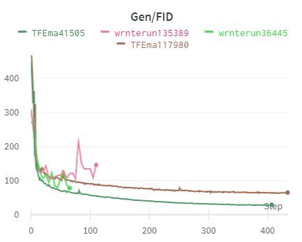

# Learning Energy-Based Models by Diffusion Recovery Likelihood-PyTorch

A PyTorch Implementation   

Paper: https://arxiv.org/pdf/2012.08125,  official TF2 code: https://github.com/ruiqigao/recovery_likelihood


## The reproducibility of official TF code

The authors use 8 TPUs to train on CIFAR10 for 40+ hours and evaluate FID using 10,000 generated samples.

Due to the computational constraints, I try num_res_blocks=2 and n_batch_train=64.  

My results (the main difference is the number of generated samples for evaluation)

| Eval num of samples | FID   | Time              |
| ------------------- | ----- | ----------------- |
| 1000                | 65    | 5 days 1.8 hours  |
| 10000               | 28.42 | 6 days 11.5 hours |




Generated samples (Top 8 rows are real data,  bottom 8 rows are generated images):




Curves of Some training variables:




# PyTorch Implementation

I almost implement the main parts of the algorithm.  

1. for simplicity, I use the Wide-ResNet 28-10 used in [JEM](https://github.com/wgrathwohl/JEM), instead of implementing the ResNet model in the paper.
2. I didn't implement the EMA(Exponential Moving Average used in the code but not mentioned in the paper), which mainly results in a fluctuated/non-smooth FID curve(verified by TF code).
3. I'm not sure whether the Spectral Norm implementation is correct. I fail to use the SN layer in my code. [SN](https://github.com/christiancosgrove/pytorch-spectral-normalization-gan)
4. I use the code from [IGEBM](https://github.com/openai/ebm_code_release) to compute FID/Inception Score.  Almost the same but still potentially a bit different from the paper.


## Results




## Requirements

```
pip install -r requirements.txt
```

## Train

CIFAR10

```
python DRLTrainer.py --num_res_blocks=8 --n_batch_train=256 
```

For faster training, reduce the value of `num_res_blocks`.

No pretrained models


## Citation

If you find their work helpful to your research :), please cite:
```
@article{gao2020learning,
  title={Learning Energy-Based Models by Diffusion Recovery Likelihood},
  author={Gao, Ruiqi and Song, Yang and Poole, Ben and Wu, Ying Nian and Kingma, Diederik P},
  journal={International Conference on Learning Representations (ICLR)},
  year={2021}
}
```
